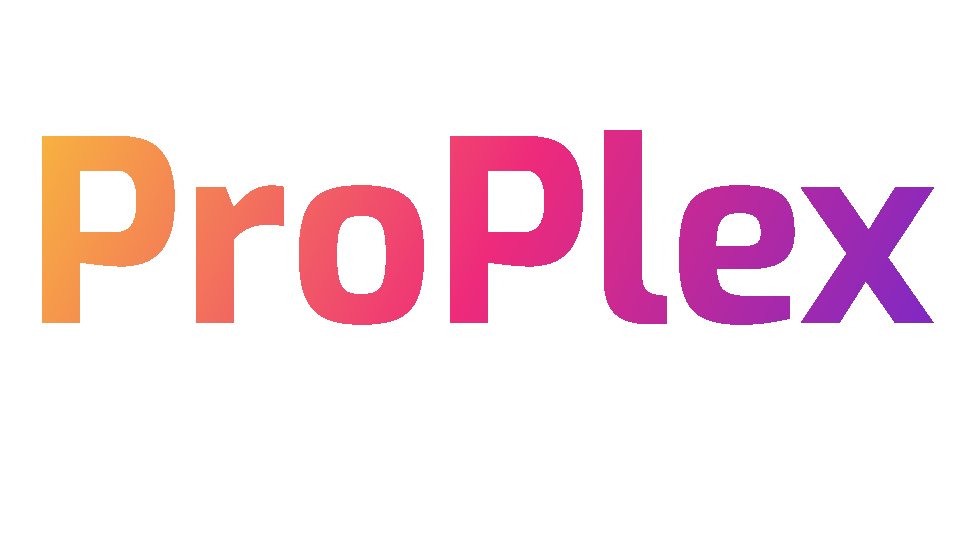

# portfolio
<a name="readme-top"></a>


<!-- PROJECT LOGO -->
<br />
<div >
  <h1 >
    
  </h1>

 


<!-- ABOUT THE PROJECT -->
## About The Project

Pro plex is a webiste where you can every person who provide's a  service in any field  will it make everything much easier to get in contact with someone specefic  easiely   

<p align="right">(<a href="#readme-top">back to top</a>)</p>


### Built With


* [![JWT][JWT.dev]][JWT-url]
* [![React][React.js]][React-url]
* [![Vit][Vit.js]][Vit-url]
* [![MaterialUI][MaterialUI.com]][MaterialUI-url]
* [![Express][Express.com]][Express-url]

<p align="right">(<a href="#readme-top">back to top</a>)</p>


<!-- GETTING STARTED -->
## Getting Started


### Prerequisites
 
  do this to make your npm updated to your latest version 

* npm
  ```sh
  npm install npm@latest -g
  ```

### Installation

_Below is an example of how you can instruct your audience on installing and setting up your app. This template doesn't rely on any external dependencies or services._


1. Clone the repo
   ```sh
   git clone https://github.com/PortfolioProject-rbk/portfolio
   ```
2. Install NPM packages (change directory to either frontend or backend before installing anything )
   ```sh
   npm install i
   ```
3. Creating dummy data for testing purpose (change directory to back end first)
   ```sh
   npm db:sync   npm db:seed
   ```


<p align="right">(<a href="#readme-top">back to top</a>)</p>


<!-- USAGE EXAMPLES -->
## Usage


<p align="right">(<a href="#readme-top">back to top</a>)</p>


<!-- ROADMAP -->
## Roadmap

- [x] Create your account 
- [x] sign in 
- [ ] create your profile
- [ ] now  you can search for other people (doesn't require to have an account )


<!-- CONTACT -->
## Contact

Your Name - [Facebook](https://www.facebook.com/forgotten.goddd/)

Project Link: [https://github.com/PortfolioProject-rbk/portfolio]

<p align="right">(<a href="#readme-top">back to top</a>)</p>


<!-- ACKNOWLEDGMENTS -->
## Acknowledgments

  Some useful links 


* [Img Shields](https://shields.io)
* [GitHub Pages](https://pages.github.com)

* [React Icons](https://react-icons.github.io/react-icons/search)

<p align="right">(<a href="#readme-top">back to top</a>)</p>


<!-- MARKDOWN LINKS & IMAGES -->
<!-- https://www.markdownguide.org/basic-syntax/#reference-style-links -->

[React.js]: https://img.shields.io/badge/React-20232A?style=for-the-badge&logo=react&logoColor=61DAFB
[React-url]: https://reactjs.org/
[Vit.js]: https://img.shields.io/badge/Vite-B73BFE?style=for-the-badge&logo=vite&logoColor=FFD62E
[Vit-url]: https://vitejs.dev/
[JWT.dev]: https://img.shields.io/badge/JWT-000000?style=for-the-badge&logo=JSON%20web%20tokens&logoColor=white
[JWT-url]: https://jwt.io/
[Express.com]: https://img.shields.io/badge/Express%20js-000000?style=for-the-badge&logo=express&logoColor=white
[Express-url]: https://expressjs.com/
[MaterialUI.com]:     https://img.shields.io/badge/Material%20UI-007FFF?style=for-the-badge&logo=mui&logoColor=white
[MaterialUI-url]: https://mui.com/

